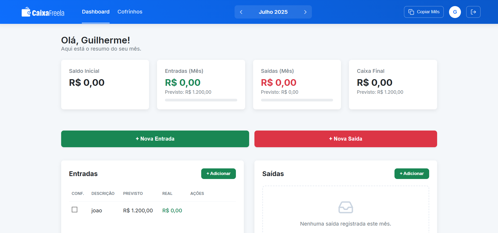

# CaixaFreela: Controle Financeiro para Freelancers 💸



## 📖 Sobre o Projeto

CaixaFreela é uma aplicação web completa, desenvolvida como uma ferramenta de controle financeiro pessoal, projetada especificamente para as necessidades de freelancers. A plataforma permite um gerenciamento detalhado das finanças mensais, separando valores previstos de valores reais, além de funcionalidades avançadas como planejamento de economias ("Cofrinhos") e insights gerados por Inteligência Artificial para ajudar na tomada de decisões.

Este projeto foi construído do zero, cobrindo todo o ciclo de desenvolvimento, desde a prototipagem e design de UI/UX até a implementação front-end com React, integração com backend Firebase e a conexão com APIs de IA.

---

## ✨ Funcionalidades Principais

* **🔐 Autenticação Segura:** Cadastro e Login com E-mail/Senha e também com provedor Google (Google Sign-In).
* **👤 Perfil de Usuário:** Página dedicada para o usuário gerenciar sua conta e alterar sua senha de forma segura.
* **📊 Dashboard Mensal:**
    * Visão geral com cards para Saldo Inicial, Entradas, Saídas e Caixa Final.
    * Comparativo visual entre valores **Previstos** e **Reais**.
    * Barras de progresso dinâmicas para acompanhamento de metas.
* **💸 CRUD Completo de Transações:** Adicione, edite e exclua entradas e saídas financeiras através de um modal interativo.
* **🏦 Cofrinhos (Reservas Financeiras):** Crie e gerencie objetivos de economia separados do fluxo de caixa mensal, com controle de depósitos e retiradas.
* **📅 Navegação Temporal:**
    * Seletor de Mês/Ano para navegar pelo histórico financeiro.
    * Função "Copiar Mês Anterior" para agilizar o planejamento do mês atual.
* **🤖 Análise com IA:** Integração com a API da Groq (usando o modelo LLaMA 3) para gerar análises e conselhos personalizados sobre a saúde financeira do mês.
* **🎨 UI/UX Refinada:**
    * Interface limpa, moderna e totalmente responsiva.
    * Efeitos de `hover` e microinterações para uma experiência de usuário mais fluida.
    * Notificações "Toast" para feedback de ações (sucesso, erro, carregamento).

---

## 🚀 Tecnologias Utilizadas

* **Frontend:**
    * **React.js** (com Hooks e Context API)
    * **Vite** (Build Tool)
    * **React Router DOM** (Roteamento)
    * **CSS Modules** (Estilização)
* **Backend & Banco de Dados:**
    * **Firebase Authentication** (Gerenciamento de usuários)
    * **Firebase Firestore** (Banco de Dados NoSQL em tempo real)
* **APIs Externas:**
    * **Groq API** (Inteligência Artificial - LLaMA 3)
* **Bibliotecas Adicionais:**
    * **Recharts** (Gráficos)
    * **React Hot Toast** (Notificações)
    * **Lucide React** (Ícones)
    * **date-fns** (Manipulação de Datas)

---

## ⚙️ Como Executar o Projeto Localmente

Siga os passos abaixo para configurar e executar a aplicação na sua máquina.

### Pré-requisitos
* **Node.js** (versão 18 ou superior)
* **npm** ou **yarn**
* Uma conta no **Firebase** e no **Groq**

### Instalação

1.  **Clone o repositório:**
    ```bash
    git clone [URL_DO_SEU_REPOSITORIO]
    cd caixafreela
    ```

2.  **Instale as dependências:**
    ```bash
    npm install
    ```

3.  **Configure o Firebase:**
    * Crie um novo projeto no [Console do Firebase](https://console.firebase.google.com/).
    * Habilite os serviços de **Authentication** (com os provedores E-mail/Senha e Google) e **Firestore Database** (inicie em modo de teste).
    * Nas configurações do seu projeto, crie um novo "App da Web" para obter suas chaves de configuração.

4.  **Configure as Variáveis de Ambiente:**
    * Na raiz do projeto, crie um ficheiro chamado `.env.local`.
    * Copie o conteúdo abaixo e substitua pelos seus próprios valores:

    ```env
    # Chaves do seu projeto Firebase
    VITE_API_KEY="SUA_API_KEY"
    VITE_AUTH_DOMAIN="SEU_AUTH_DOMAIN"
    VITE_PROJECT_ID="SEU_PROJECT_ID"
    VITE_STORAGE_BUCKET="SEU_STORAGE_BUCKET"
    VITE_MESSAGING_SENDER_ID="SEU_MESSAGING_SENDER_ID"
    VITE_APP_ID="SEU_APP_ID"

    # Chave da API da Groq
    VITE_GROQ_API_KEY="SUA_CHAVE_DA_GROQ"
    ```

5.  **Execute a aplicação:**
    ```bash
    npm run dev
    ```
    A aplicação estará disponível em `http://localhost:5173`.

---

## 📄 Licença

Este projeto está sob a licença MIT. Veja o ficheiro `LICENSE` para mais detalhes.
